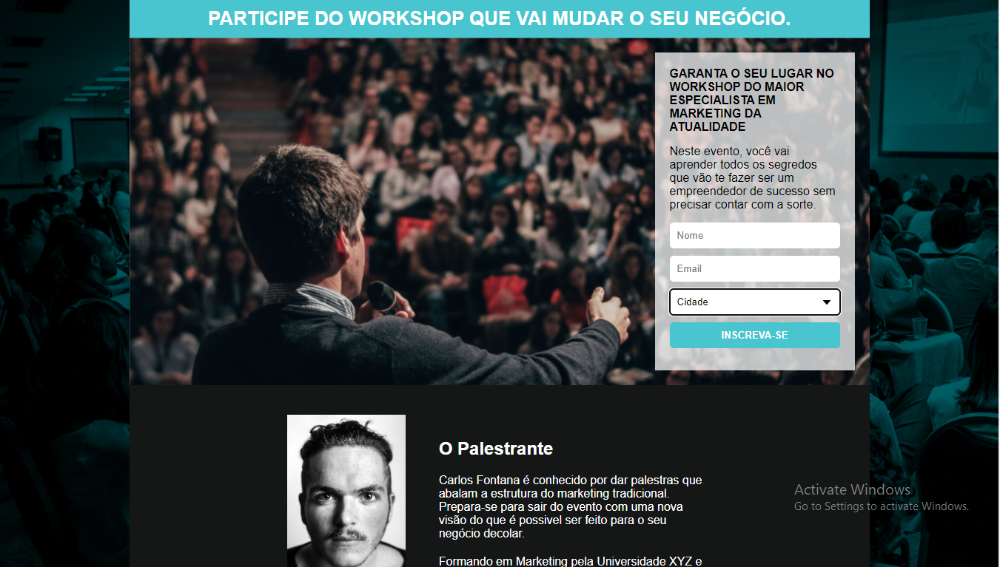

<h1  align="center">
 Workshop
</h1>


## 💻 Projeto Workshop

O projeto é um site de captura de
**Email** de possíveis clientes.


<h1 align="center">
    
</h1>

## Tecnologias

Este projeto foi desenvolvido com as seguintes tecnologias:

- HTML
- CSS
- MAILCHIMP


## Como Executar
Para clonar e executar este site,
execute os seguintes comando.

1. Faça um clone do repositório:

```sh
  $ git clone https://github.com/Djaysson/workshop.git
```
2. Executando a Aplicação:

```sh
# Abra a pasta
  $ cd workshop
  # abra o arquivo index.html
  $ click no index.html

```
